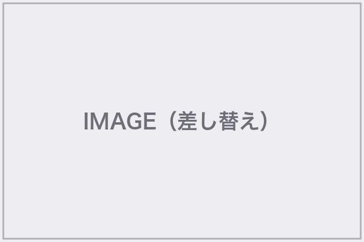
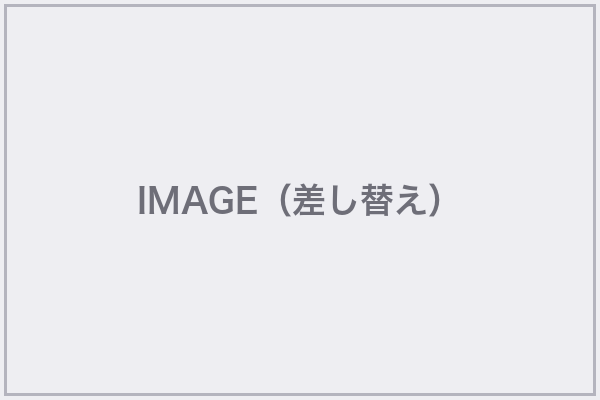
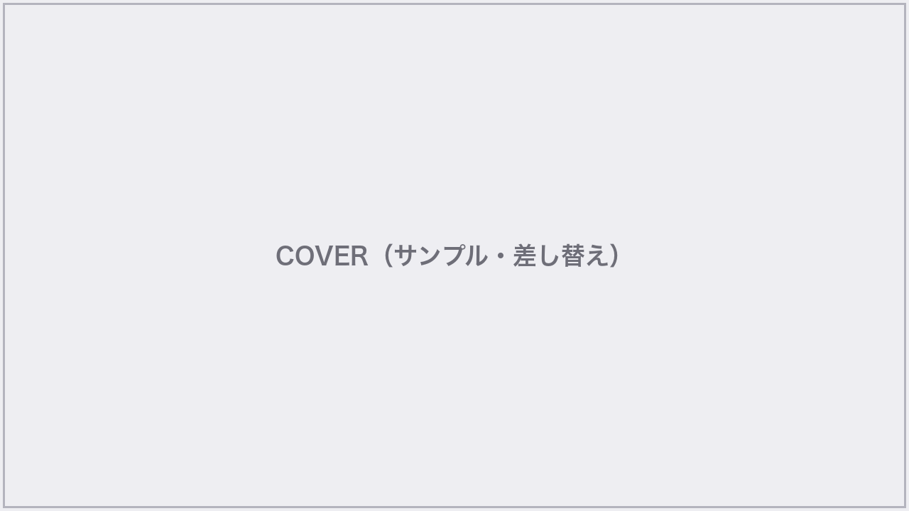
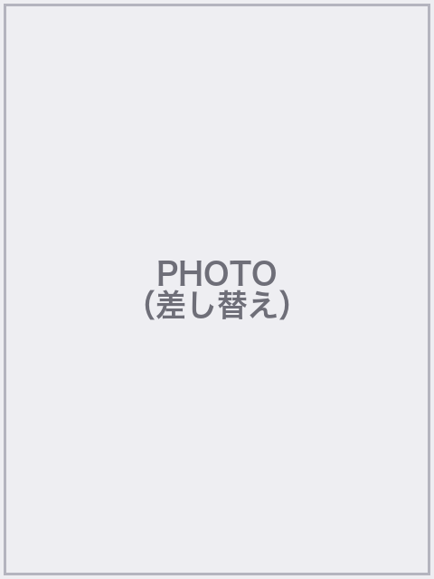

# HTMLスライド：本文レイアウトパターンカタログ

**用途**: 表紙・AGENDA・セクション扉・§4 画像左テキスト右の**あと**に使う、**一般向け本文スライド**の型。  
**コピー**: `references/html-slide-plain-japanese.md` に従い、**平易な日本語**で埋める。英語プレースホルダ（`Learn more` / `CATEGORY` 等）は **日本語に差し替え**るか削除。

**CSS 実装**: `Addness/04-output/slides/hp-upstream-pillars-html/css/body-patterns.css`（クラス名 `.html-tpl-pat-*`）。**このファイルは増やすたびに更新日を記録する。**

**更新履歴**

- 2026-03-31 — 初版（プロセスフロー・3カード・Before/After・2択比較・5理由・引用・ステートメント）
- 2026-05-07 — §H Xアカウントグリッド・§I ロゴ中央表紙・§J 代表紹介リストを追加
- 2026-05-11 — §K〜§T 追加（タイムライン・メトリクス・ギャラリー・ファネル・アイコンリスト・画像右テキスト左・チーム紹介・ロゴウォール・ステップカード・CTA クロージング）+ ブランド 新サイトアセット参照を追加
- 2026-05-11 — §U〜§Z 追加（PPTX テンプレート由来: 数字ハイライト・テーブル・タイトル付き画像・箇条書き＋サイドメッセージ・グラフ/パイ・テキスト強調グラデーション）+ ブランド ブランドカラー（紫 `#9b8cff` / オレンジ `#c87941` / 黒 `#1a1a2e`）に全面移行。アクセント `#e94560` → `#9b8cff` に変更

---

## 使い方（共通）

- 親は `<section class="slide slide-html-tpl-pat"><div class="slide-content slide-content--flush"><div class="html-tpl-pat-process">…</div></div></section>` の形（パターンごとにルートクラス名が違う）。
- 画像は **ブランド 新サイトアセット**（本ファイル末尾のアセットマップ参照）を優先。雰囲気写真・背景テクスチャは **Unsplash**（`html-slide-unsplash-guide.md`）を活用。`picsum` はドラフト段階のみ許可。

---

## §A 横並びプロセスフロー（4ステップ + 矢印）

**向き**: 流れ・手順・ロードマップを見せるとき。

クラス: `.html-tpl-pat-process`（ルート） / `__title` / `__track` / `__arrow` / `__step` / `__step-num` / `__step-ja` / `__step-en`  
ステップの色は `__step--t1` … `__step--t4` で変える。

---

## §B 3カード（サービス・特徴紹介）

クラス: `.html-tpl-pat-cards3` / `__title` / `__row` / `__card` / `__card--dark` / `__num` / `__h3` / `__p` / `__cta`  
**CTA は日本語**（例: 「詳しく見る →」）に。

---

## §C Before / After

クラス: `.html-tpl-pat-befaft` / `__title` / `__row` / `__col` / `__col--before` / `__col--after` / `__label` / `__list` / `__item` / `__mid`（中央矢印）

---

## §D 2列オプション比較（A / B）

クラス: `.html-tpl-pat-opt2` / `__col` / `__col--light` / `__col--dark` / `__badge` / `__h3` / `__p` / `__checks`

---

## §E 5つの理由（5カラム + 数字丸）

クラス: `.html-tpl-pat-five` / `__title` / `__lead` / `__row` / `__card` / `__card--invert` / `__circle` / `__h3` / `__p` / `__metric` / `__metric-num` / `__metric-label`

---

## §F 引用 + 写真（左40%）

クラス: `.html-tpl-pat-quote` / `__photo` / `__body` / `__mark` / `__text` / `__bar` / `__name` / `__role`

---

## §G 大きなメッセージ（全面ダーク）

クラス: `.html-tpl-pat-statement` / `__inner` / `__text` / `__accent`

---

## インラインHTML（コピペ用・元デザイン）

以下は **そのまま** `slides.js` に貼れるインライン版。クラス版は `body-patterns.css` を参照。

（※長いため、実装時は `body-patterns.css` のクラスを使うことを推奨。インラインは緊急用。）

## クラス版の最小例（§A プロセスフロー）

```html
<div class="html-tpl-pat-process">
  <h2 class="html-tpl-pat-process__title">見出し（平易な日本語で）</h2>
  <div class="html-tpl-pat-process__track">
    <div class="html-tpl-pat-process__step html-tpl-pat-process__step--t1">
      <div class="html-tpl-pat-process__step-num">01</div>
      <div class="html-tpl-pat-process__step-ja">企画</div>
      <div class="html-tpl-pat-process__step-en">Planning</div>
    </div>
    <div class="html-tpl-pat-process__arrow" aria-hidden="true">&#9654;</div>
    <!-- ステップを繰り返し、t2 / t3 / t4 を付け替え -->
  </div>
</div>
```

英語行（`__step-en`）は **省略可**。省略する場合は要素ごと削除。

---

---

## §H Xアカウントグリッド（SNS実績紹介）

**向き**: ブランドが運営する X アカウント群をプロフィール画像＋フォロワー数で一覧表示するとき。提案資料の「実績」セクションで使う。

クラス: `.x-accounts-grid`（4列グリッド） / `.x-account-card` / `.x-avatar` / `.x-account-info` / `.x-account-name` / `.x-account-handle` / `.x-account-followers`

**データソース**: `assets/x-followers.json`
**画像**: `assets/x-profiles/*.jpg`

```html
<div class="x-accounts-grid">
  <div class="x-account-card">
    
    <div class="x-account-info">
      <div class="x-account-name">サンプルスタジオ</div>
      <div class="x-account-handle">@your_main</div>
      <div class="x-account-followers">（フォロワー数）</div>
    </div>
  </div>
  <!-- 残り 7 アカウント分を繰り返し -->
</div>
```

---

## §I ロゴ中央表紙（提案資料用）

**向き**: 提案・見積もり資料の表紙。ロゴを大きく中央に、下にサブタイトル・宛先・日付。

クラス: `.cover-logo-only` / `.cover-logo-center` / `.cover-subtitle` / `.cover-for` / `.cover-date`

```html
<div class="cover-logo-only">
  
  <p class="cover-subtitle">AI メモリ設計ご提案資料</p>
  <p class="cover-for">○○株式会社様</p>
  <p class="cover-date">2026年○月○日</p>
</div>
```

---

## §J 代表紹介（番号付き実績リスト）

**向き**: §4（画像左 + テキスト右）と組み合わせて代表の経歴・実績を紹介するとき。

クラス: `.ceo-facts` / `.ceo-fact` / `.ceo-fact-icon`

```html
<div class="ceo-facts">
  <div class="ceo-fact"><span class="ceo-fact-icon">01</span><span>（実績例）</span></div>
  <div class="ceo-fact"><span class="ceo-fact-icon">02</span><span>初年度売上 5,500万円</span></div>
  <!-- 続き -->
</div>
```

---

## 付録: インラインHTML原文（ユーザー提供・緊急コピペ用）

以下は **インラインのみ**の参照用。メンテは **body-patterns.css のクラス版**を優先。

### プロセスフロー

```html
<div style="width:100%;height:100%;display:flex;flex-direction:column;font-family:'Helvetica Neue','Hiragino Kaku Gothic ProN',sans-serif;background:#fff;padding:4vw 5vw;">
  <h2 style="font-size:3vw;font-weight:800;color:#1a1a2e;margin-bottom:3vw;">プロセスフロー</h2>
  <div style="flex:1;display:flex;align-items:center;justify-content:center;gap:1vw;">
    <div style="background:#1a1a2e;color:#fff;padding:2vw 2.5vw;border-radius:.5vw;text-align:center;flex:1;">
      <div style="font-size:2.4vw;font-weight:800;margin-bottom:.5vw;">01</div>
      <div style="font-size:1.5vw;font-weight:600;">企画</div>
      <div style="font-size:1.2vw;color:rgba(255,255,255,.6);margin-top:.5vw;">Planning</div>
    </div>
    <div style="font-size:2.4vw;color:#c0c0d0;">&#9654;</div>
    <!-- 以下同様に 02〜04 を続ける -->
  </div>
</div>
```

（3カード・Before/After・2択・5理由・引用・ステートメントのインライン原文は必要ならこのファイルに追記してよい。長いため **CSS クラス + body-patterns.css** を正とする。）

---

## §K 縦タイムライン（沿革・ロードマップ）

**向き**: 創業ストーリー、プロジェクト経緯、将来のロードマップなど時系列を見せるとき。

クラス: `.html-tpl-pat-timeline` / `__title` / `__line`（中央の縦線） / `__item` / `__item--left` / `__item--right`（交互配置） / `__dot` / `__year` / `__desc`

**特徴**: 中央に細い縦線（`#9b8cff`）、左右交互にカードを配置。ドットが線上にアンカー。3〜6件が見やすい。

```html
<div class="html-tpl-pat-timeline">
  <h2 class="html-tpl-pat-timeline__title">これまでの歩み</h2>
  <div class="html-tpl-pat-timeline__line">
    <div class="html-tpl-pat-timeline__item html-tpl-pat-timeline__item--left">
      <div class="html-tpl-pat-timeline__dot"></div>
      <div class="html-tpl-pat-timeline__year">2024</div>
      <div class="html-tpl-pat-timeline__desc">ブランド 設立。AI × マーケティングの探求を開始</div>
    </div>
    <div class="html-tpl-pat-timeline__item html-tpl-pat-timeline__item--right">
      <div class="html-tpl-pat-timeline__dot"></div>
      <div class="html-tpl-pat-timeline__year">2025</div>
      <div class="html-tpl-pat-timeline__desc">X 運用で総フォロワー 10 万人突破</div>
    </div>
    <!-- 時系列を繰り返し -->
  </div>
</div>
```

---

## §L 数字ハイライト（メトリクスグリッド）

**向き**: KPI・実績・成果を大きな数字で一覧するとき。提案資料の「実績紹介」セクションに最適。

クラス: `.html-tpl-pat-metrics` / `__title` / `__grid`（2×2 or 1×4） / `__cell` / `__num`（大きな数字） / `__label`（説明） / `__cell--accent`（アクセント背景版）

**特徴**: 数字は `5vw` 級の大フォント＋`#9b8cff` で目立たせる。2×2 グリッドが標準、横4列も可。

```html
<div class="html-tpl-pat-metrics">
  <h2 class="html-tpl-pat-metrics__title">ブランド の実績</h2>
  <div class="html-tpl-pat-metrics__grid">
    <div class="html-tpl-pat-metrics__cell">
      <div class="html-tpl-pat-metrics__num">100,000+</div>
      <div class="html-tpl-pat-metrics__label">X 総フォロワー数</div>
    </div>
    <div class="html-tpl-pat-metrics__cell">
      <div class="html-tpl-pat-metrics__num">8</div>
      <div class="html-tpl-pat-metrics__label">運営アカウント数</div>
    </div>
    <div class="html-tpl-pat-metrics__cell">
      <div class="html-tpl-pat-metrics__num">5,500万</div>
      <div class="html-tpl-pat-metrics__label">初年度売上</div>
    </div>
    <div class="html-tpl-pat-metrics__cell html-tpl-pat-metrics__cell--accent">
      <div class="html-tpl-pat-metrics__num">6ヶ月</div>
      <div class="html-tpl-pat-metrics__label">設立から M&A まで</div>
    </div>
  </div>
</div>
```

---

## §M 画像ギャラリー（2×2 / 3列）

**向き**: 事例写真・イベント写真・ギャラリー画像・AI ワーキング風景などを並べて見せるとき。

クラス: `.html-tpl-pat-gallery` / `__title` / `__grid`（CSS Grid） / `__grid--2x2` / `__grid--3col` / `__item` / `__img` / `__caption`

**特徴**: 画像は `object-fit: cover` で統一。キャプションは任意。ブランド アセットの `gallery_img01〜05`、`event_photo`、`mv_ai_working01〜04` 等と組み合わせると効果的。

```html
<div class="html-tpl-pat-gallery">
  <h2 class="html-tpl-pat-gallery__title">AI が働く現場</h2>
  <div class="html-tpl-pat-gallery__grid html-tpl-pat-gallery__grid--2x2">
    <div class="html-tpl-pat-gallery__item">
      
      <div class="html-tpl-pat-gallery__caption">コンテンツ自動生成</div>
    </div>
    <div class="html-tpl-pat-gallery__item">
      
      <div class="html-tpl-pat-gallery__caption">データ分析</div>
    </div>
    <div class="html-tpl-pat-gallery__item">
      
      <div class="html-tpl-pat-gallery__caption">イベント登壇</div>
    </div>
    <div class="html-tpl-pat-gallery__item">
      
      <div class="html-tpl-pat-gallery__caption">成果物の一例</div>
    </div>
  </div>
</div>
```

---

## §N ファネル（コンバージョン・導入フロー）

**向き**: 認知→興味→検討→導入のような段階的な絞り込み・変換プロセスを見せるとき。

クラス: `.html-tpl-pat-funnel` / `__title` / `__stages` / `__stage`（台形型） / `__stage--1` … `__stage--4` / `__stage-label` / `__stage-desc` / `__stage-num`

**特徴**: 上が広く下が狭い台形を縦に重ねる。各段の幅は `90%` → `70%` → `50%` → `35%` のように段階的に狭める。色は `#1a1a2e` → `#9b8cff` のグラデーション。

```html
<div class="html-tpl-pat-funnel">
  <h2 class="html-tpl-pat-funnel__title">導入までの流れ</h2>
  <div class="html-tpl-pat-funnel__stages">
    <div class="html-tpl-pat-funnel__stage html-tpl-pat-funnel__stage--1">
      <div class="html-tpl-pat-funnel__stage-label">認知</div>
      <div class="html-tpl-pat-funnel__stage-desc">セミナー・記事で知る</div>
    </div>
    <div class="html-tpl-pat-funnel__stage html-tpl-pat-funnel__stage--2">
      <div class="html-tpl-pat-funnel__stage-label">興味</div>
      <div class="html-tpl-pat-funnel__stage-desc">資料請求・無料相談</div>
    </div>
    <div class="html-tpl-pat-funnel__stage html-tpl-pat-funnel__stage--3">
      <div class="html-tpl-pat-funnel__stage-label">検討</div>
      <div class="html-tpl-pat-funnel__stage-desc">提案・見積もり</div>
    </div>
    <div class="html-tpl-pat-funnel__stage html-tpl-pat-funnel__stage--4">
      <div class="html-tpl-pat-funnel__stage-label">導入</div>
      <div class="html-tpl-pat-funnel__stage-desc">契約・キックオフ</div>
    </div>
  </div>
</div>
```

---

## §O アイコン付きリスト（特徴・メリット縦並び）

**向き**: サービスの特徴やメリットを、アイコン画像＋テキストの横並びで縦にリストするとき。`point_ico01〜06` と相性抜群。

クラス: `.html-tpl-pat-iconlist` / `__title` / `__list` / `__row` / `__icon`（48〜64px） / `__text` / `__text-h3` / `__text-p`

**特徴**: 左にアイコン画像、右に見出し＋説明の2段。3〜5件がベスト。ブランド アセットの `point_ico01〜06`、`about_ico01〜04` を使うと統一感が出る。

```html
<div class="html-tpl-pat-iconlist">
  <h2 class="html-tpl-pat-iconlist__title">ブランド が選ばれる理由</h2>
  <div class="html-tpl-pat-iconlist__list">
    <div class="html-tpl-pat-iconlist__row">
      
      <div class="html-tpl-pat-iconlist__text">
        <h3 class="html-tpl-pat-iconlist__text-h3">AI で自動化</h3>
        <p class="html-tpl-pat-iconlist__text-p">投稿の企画から配信まで、AI が一気通貫で対応します</p>
      </div>
    </div>
    <div class="html-tpl-pat-iconlist__row">
      
      <div class="html-tpl-pat-iconlist__text">
        <h3 class="html-tpl-pat-iconlist__text-h3">データ駆動の改善</h3>
        <p class="html-tpl-pat-iconlist__text-p">バズ分析の知見をリアルタイムに反映し続けます</p>
      </div>
    </div>
    <!-- 続き -->
  </div>
</div>
```

---

## §P 画像右・テキスト左（§4 の左右反転）

**向き**: §4（画像左・テキスト右）と交互に使い、視覚のリズムを作るとき。連続スライドの単調さを防ぐ。

クラス: `.html-tpl-pat-txtimg` / `__content`（左テキスト） / `__visual`（右画像） / `__kicker` / `__title` / `__text`

**特徴**: `flex-direction: row`（テキスト左 → 画像右）。§4 と同じ比率（50:50）。代表紹介やサービス紹介で §4 と交互に使うとデッキにリズムが出る。

```html
<div class="html-tpl-pat-txtimg">
  <div class="html-tpl-pat-txtimg__content">
    <div class="html-tpl-pat-txtimg__kicker">サービス紹介</div>
    <h2 class="html-tpl-pat-txtimg__title">ナレッジを<br>資産に変える</h2>
    <p class="html-tpl-pat-txtimg__text">社内に眠る知見を AI が構造化し、誰でも検索・活用できる状態にします。</p>
  </div>
  <div class="html-tpl-pat-txtimg__visual" style="background-image:url('assets/illust_knowledge.png');background-size:cover;background-position:center;"></div>
</div>
```

---

## §Q チーム紹介グリッド（写真＋名前＋役割）

**向き**: チームメンバー・登壇者・パートナーを顔写真付きで一覧するとき。

クラス: `.html-tpl-pat-team` / `__title` / `__grid`（2〜4列） / `__card` / `__photo`（正円 `border-radius: 50%`） / `__name` / `__role` / `__desc`

**特徴**: 写真を正円にクロップし、下に名前・役割を配置。2〜4人が1スライドの適正。ブランド の `ceo-profile.png`、`ceo-stage.png`、`op_mvimg_person01〜02.png` が使える。

```html
<div class="html-tpl-pat-team">
  <h2 class="html-tpl-pat-team__title">プロジェクトチーム</h2>
  <div class="html-tpl-pat-team__grid">
    <div class="html-tpl-pat-team__card">
      
      <div class="html-tpl-pat-team__name">講師 太郎</div>
      <div class="html-tpl-pat-team__role">代表取締役 / CMO</div>
      <div class="html-tpl-pat-team__desc">AI マーケティングの設計・統括</div>
    </div>
    <div class="html-tpl-pat-team__card">
      
      <div class="html-tpl-pat-team__name">メンバー名</div>
      <div class="html-tpl-pat-team__role">エンジニア</div>
      <div class="html-tpl-pat-team__desc">AI パイプライン開発</div>
    </div>
    <!-- 続き -->
  </div>
</div>
```

---

## §R ロゴウォール（パートナー・導入企業）

**向き**: 取引先・パートナー・導入企業のロゴを並べて信頼性を見せるとき。

クラス: `.html-tpl-pat-logowall` / `__title` / `__subtitle` / `__grid`（3〜4列 × 2〜3行） / `__logo`（`object-fit: contain`・グレースケール → ホバーでカラー）

**特徴**: ロゴは `grayscale(100%)` で統一感を出し、ホバーで `grayscale(0)` に。背景は `#f8f8fc` で白より少し色味を持たせる。ブランド ロゴ自体は含めない（自社紹介用）。

```html
<div class="html-tpl-pat-logowall">
  <h2 class="html-tpl-pat-logowall__title">導入いただいている企業様</h2>
  <p class="html-tpl-pat-logowall__subtitle">（一部抜粋）</p>
  <div class="html-tpl-pat-logowall__grid">
    
    
    
    <!-- 6〜12枚が見栄え良い -->
  </div>
</div>
```

---

## §S 横並びステップカード（番号＋画像＋説明）

**向き**: 導入手順・利用開始ステップなど、画像付きで手順を見せるとき。§A プロセスフローより情報量が多い場合に。

クラス: `.html-tpl-pat-stepcards` / `__title` / `__row` / `__card` / `__card-img` / `__card-num` / `__card-h3` / `__card-p` / `__connector`（カード間の矢印線）

**特徴**: 3〜4列のカード。各カードの上部に画像、中央に番号バッジ、下に見出し＋説明。ブランド の `step_img01〜04` がそのまま使える。

```html
<div class="html-tpl-pat-stepcards">
  <h2 class="html-tpl-pat-stepcards__title">ご利用の流れ</h2>
  <div class="html-tpl-pat-stepcards__row">
    <div class="html-tpl-pat-stepcards__card">
      
      <div class="html-tpl-pat-stepcards__card-num">01</div>
      <h3 class="html-tpl-pat-stepcards__card-h3">ヒアリング</h3>
      <p class="html-tpl-pat-stepcards__card-p">現状の課題と目指す姿を伺います</p>
    </div>
    <div class="html-tpl-pat-stepcards__connector" aria-hidden="true">&#9654;</div>
    <div class="html-tpl-pat-stepcards__card">
      
      <div class="html-tpl-pat-stepcards__card-num">02</div>
      <h3 class="html-tpl-pat-stepcards__card-h3">設計・提案</h3>
      <p class="html-tpl-pat-stepcards__card-p">AI パイプラインの全体像をご提案</p>
    </div>
    <div class="html-tpl-pat-stepcards__connector" aria-hidden="true">&#9654;</div>
    <div class="html-tpl-pat-stepcards__card">
      
      <div class="html-tpl-pat-stepcards__card-num">03</div>
      <h3 class="html-tpl-pat-stepcards__card-h3">構築・運用</h3>
      <p class="html-tpl-pat-stepcards__card-p">実装から安定稼働まで伴走します</p>
    </div>
    <!-- 必要に応じて 04 追加 -->
  </div>
</div>
```

---

## §T CTA クロージング（行動喚起＋ロゴ）

**向き**: デッキの最終スライド。次のアクションを明確に促すとき。

クラス: `.html-tpl-pat-cta` / `__bg`（全面ダーク `#1a1a2e`） / `__logo`（白反転ロゴ） / `__message`（メイン訴求） / `__actions`（ボタン群） / `__btn` / `__btn--primary`（`#9b8cff`） / `__btn--secondary` / `__contact`（連絡先テキスト）

**特徴**: 全面ダーク背景に白文字＋アクセントボタン。ロゴは白反転で中央上に配置。ボタンは1〜2個。

```html
<div class="html-tpl-pat-cta">
  <div class="html-tpl-pat-cta__bg">
    
    <h2 class="html-tpl-pat-cta__message">まずは無料でご相談ください</h2>
    <div class="html-tpl-pat-cta__actions">
      <a class="html-tpl-pat-cta__btn html-tpl-pat-cta__btn--primary">お問い合わせ</a>
      <a class="html-tpl-pat-cta__btn html-tpl-pat-cta__btn--secondary">資料をダウンロード</a>
    </div>
    <p class="html-tpl-pat-cta__contact">you@example.com</p>
  </div>
</div>
```

---

## §U 数字ハイライト（PPTX: 大きな数字＋メッセージ）

**向き**: 成果指標・驚きの数字を大きく1つ見せて印象づけるとき。PPTX テンプレートの「100%」パターン。

クラス: `.tpl-numhighlight`（ルート） / `__num`（12cqw 超大数字） / `__label`（見出し） / `__desc`（補足）/ `--dark`（ダーク背景版: 数字がオレンジ）

**特徴**: 数字は Helvetica で `12cqw`、`--c-accent`（紫）で強調。ダーク版は `--c-orange` で数字を目立たせる。

```html
<div class="tpl-numhighlight">
  <div class="tpl-numhighlight__num">100%</div>
  <div class="tpl-numhighlight__label">投稿自動化率</div>
  <div class="tpl-numhighlight__desc">全 X アカウントの投稿を AI が自動生成・配信</div>
</div>
```

---

## §V テーブル（PPTX: 表形式データ）

**向き**: 比較表・料金表・機能一覧など、行×列の整理が必要なとき。PPTX テンプレートのテーブルパターン。

クラス: `.tpl-table`（ルート） / `__title` / `table` / `th`（ダーク背景） / `td` / 偶数行は `--c-surface` 背景

```html
<div class="tpl-table">
  <h2 class="tpl-table__title">プラン比較</h2>
  <table>
    <tr><th>項目</th><th>ライト</th><th>スタンダード</th><th>プロ</th></tr>
    <tr><td>月額</td><td>無料</td><td>¥9,800</td><td>¥29,800</td></tr>
    <tr><td>アカウント数</td><td>1</td><td>3</td><td>無制限</td></tr>
  </table>
</div>
```

---

## §W タイトル付き画像（PPTX: タイトルバー＋画像）

**向き**: スクリーンショット・デモ画面・図解を1枚大きく見せるとき。PPTX テンプレートの「ワンメッセージ＋画像」パターン。

クラス: `.tpl-titleimg`（ルート） / `__bar`（ダーク帯） / `__title`（白文字） / `__img`（画像エリア `contain`）

```html
<div class="tpl-titleimg">
  <div class="tpl-titleimg__bar">
    <h2 class="tpl-titleimg__title">Vercel のダッシュボード</h2>
  </div>
  <div class="tpl-titleimg__img" style="background-image:url('assets/screenshot.png');"></div>
</div>
```

---

## §X 箇条書き＋サイドメッセージ（PPTX: Bullet + Side Message）

**向き**: 左に詳細リスト、右に結論・キーメッセージを大きく出すとき。PPTX テンプレートの二分割パターン。

クラス: `.tpl-bullside`（ルート） / `__list` / `__item`（最初の項目は太字） / `__side`（サーフェス背景） / `__msg`（大きな結論文字）

```html
<div class="tpl-bullside">
  <div class="tpl-bullside__list">
    <div class="tpl-bullside__item">AI 投稿は人間の 5 倍の速度で量産可能</div>
    <div class="tpl-bullside__item">バズ構文のコピーで品質も担保</div>
    <div class="tpl-bullside__item">24 時間 365 日稼働</div>
  </div>
  <div class="tpl-bullside__side">
    <div class="tpl-bullside__msg">人を増やさず<br>成果を増やす</div>
  </div>
</div>
```

---

## §Y グラフ / パイチャート（PPTX: 円グラフ＋凡例）

**向き**: 割合・構成比を視覚的に伝えるとき。PPTX テンプレートのパイチャート＋質問パターン。

クラス: `.tpl-graph`（ルート） / `__chart`（円形エリア、`conic-gradient` で描画） / `__center`（中央の数字） / `__info` / `__question` / `__legend` / `__legend-item` / `__legend-dot`

**実装**: `conic-gradient` で疑似パイチャートを CSS のみで描く。色は `--c-accent`, `--c-orange`, `--c-accent-dark`, `--c-muted` を使い分ける。

---

## §Z テキスト強調（PPTX: グラデーション版ステートメント）

**向き**: §G ステートメントのバリエーション。ブランド ブランドグラデーション背景で強い印象を出すとき。

クラス: `.tpl-statement-grad`（ルート） / `__text`（白文字 + text-shadow）

```html
<div class="tpl-statement-grad">
  <div class="tpl-statement-grad__text">URLひとつで、<br>あなたの仕事は世界に届く</div>
</div>
```

---

## ブランド ブランドカラー早見表

全パターン共通の配色。デッキの `css/style.css` の `:root` で CSS 変数として定義する。

| 変数 | 値 | 用途 |
|------|-----|------|
| `--c-dark` | `#1a1a2e` | 見出し・ダーク背景・テーブルヘッダ |
| `--c-accent` | `#9b8cff` | 番号・キッカー・アクティブ要素・ブリッジ |
| `--c-accent-dark` | `#7b6ce0` | グラデーション起点・ホバー |
| `--c-orange` | `#c87941` | 第2アクセント・ワークバッジ・ダーク版数字 |
| `--c-orange-light` | `#e8b88a` | グラデーション中間・装飾 |
| `--c-surface` | `#f4f2fb` | タイル・カード・表紙の背景 |
| `--c-muted` | `#6c6c8a` | サブテキスト・説明文 |
| `--c-border` | `#e0ddf0` | カード・タイル枠線 |
| `--c-gradient` | `linear-gradient(145deg, #7b6ce0 0%, #9b8cff 24%, #c87941 49%, #e8b88a 74%, #f7f0f6 100%)` | アクセントバー・装飾ライン・ステートメント背景 |

---

---

## ブランド 新サイトアセット一覧（スライド素材として利用可）

**ソース**: `<社内ナレッジ>/株式会社アイウエオ/assets/img/`

デッキ作成時にこのディレクトリから `<出力先>/assets/` にコピーして使う。`picsum` プレースホルダより **実素材を優先**。

### 用途別アセットマップ

| 用途 | ファイル名 | 推奨パターン |
|------|-----------|-------------|
| **メインビジュアル** | `hero_main.png`, `kv-2.png`, `kv-3.png` | 表紙（§I / §4）、§G ステートメント背景 |
| **代表写真** | `ceo-profile.png`, `ceo-stage.png`, `ceo-message.png`, `speaker-ceo.jpg` | §F 引用、§J 代表紹介、§Q チーム |
| **AI ワーキング** | `mv_ai_working01〜04.png` | §M ギャラリー、§4 画像左、§P 画像右 |
| **サービス紹介** | `service_items.png`, `illust_tools.png`, `illust_knowledge.png` | §B 3カード背景、§P テキスト左 |
| **導入ステップ** | `step_img01〜04.png` | §S ステップカード、§A プロセスフロー |
| **特徴アイコン** | `point_ico01〜06.png` | §O アイコンリスト |
| **特徴ビジュアル** | `point_img01〜06.png`, `point_img01_knowledge.png`, `point_img02_sns.png` | §4 画像左、§P 画像右、§B カード |
| **About アイコン** | `about_ico01〜04.png` | §O アイコンリスト、§E 5理由 |
| **About イメージ** | `about_img01.png`, `about_img02.png` | §4 画像左、§M ギャラリー |
| **アニメフレーム** | `about_ani01〜04.png` | §M ギャラリー（動きの流れを表現） |
| **ギャラリー** | `gallery_img01〜05.png` | §M ギャラリー |
| **イベント** | `event_photo.png`, `event_retokyo.png`, `event_retokyo_new.png` | §M ギャラリー、§F 引用 |
| **バリュー・ビジョン** | `value-bet.png`, `value-good.png`, `value-thanks.png`, `vision-place.png` | §G ステートメント、§B カード |
| **装飾** | `illust_deco01.png`, `illust_deco02.png`, `bg-1.png`, `feature_bg.png` | 背景装飾、セクション扉 |
| **CTA 番号** | `lets_num01〜04.png` | §S ステップカード番号、§T CTA |
| **OP アイテム** | `op_item01〜05.png`, `op_mvimg_desk.png` | §B カード、§O アイコンリスト |
| **人物** | `op_mvimg_person01.png`, `op_mvimg_person02.png` | §Q チーム紹介、§F 引用 |
| **X プロフィール** | `<社内ナレッジ>/株式会社アイウエオ/assets/x-profiles/` | §H X アカウントグリッド |
| **ロゴ** | `brand-logo.png` | §I 表紙、§T CTA クロージング |

### アセット取得の優先順位

1. `<社内ナレッジ>/株式会社アイウエオ/assets/img/` — 最新デザインの素材（上表）
2. `corporate-site/assets/` — X プロフィール画像・フォロワー数 JSON・旧ロゴ
3. `brand-assets/` — スライドスキル同梱のロゴ・代表写真（fallback）
4. `picsum.photos` — ドラフト段階のみ許可。納品では実素材に差し替え
